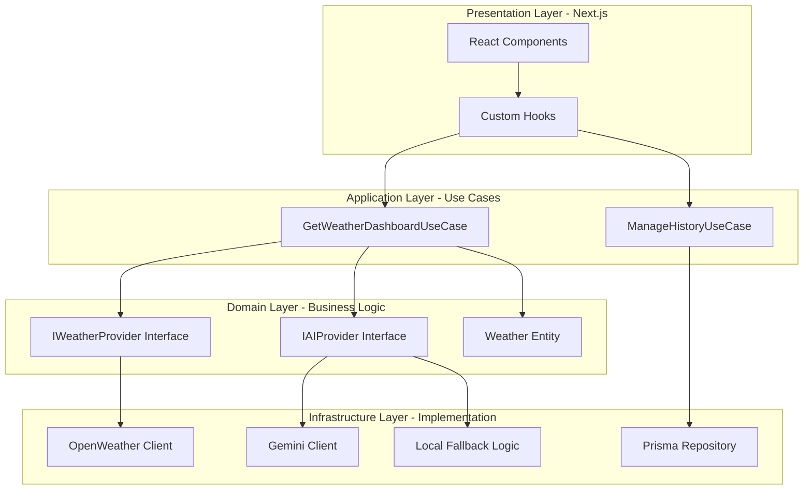

# WeatherSuite Intelligence Dashboard

[](https://nextjs.org/)
[](https://www.typescriptlang.org/)
[](https://www.prisma.io/)
[](https://ai.google.dev/)

> **Part of the PM Accelerator AI Engineer Assessment.**  
> A unified Weather & Media Intelligence platform built with a redundant, Clean Architecture design and premium Glassmorphic aesthetics.

---

## 🌟 Overview

**WeatherSuite Intelligence** is not just a weather app; it's a decision-support dashboard that merges real-time meteorological data with agentic AI insights and contextual video intelligence. It is designed to demonstrate high-level engineering maturity, focusing on **reliability**, **maintainability**, and **visual excellence**.

---

## ✨ Core Features

| Feature | Description | Status |
| :--- | :--- | :--- |
| **Agentic AI Analyst** | Real-time weather insights powered by **Google Gemini 2.0**. Includes a resilient local fallback system for 100% uptime. | ✅ Active |
| **Media Intelligence** | Contextual travel and climate videos pulled dynamically via the **YouTube Data API**. | ✅ Active |
| **Precision Mapping** | Interactive location context maps with the ability to jump to **Live Satellite** views. | ✅ Active |
| **Air Quality Monitoring** | Integrated **AQI (Air Quality Index)** monitoring with visual risk indicators. | ✅ Active |
| **Persistent History** | A sidecar search history system powered by **Prisma & SQLite** for high-performance local tracking. | ✅ Active |
| **Glassmorphic UI** | A premium, futuristic interface using semi-transparent layers, backdrop blurs, and micro-animations. | ✅ Active |

---

## 🏗️ Technical Architecture

This project strictly follows **Clean Architecture (Domain-Driven Design)** principles to isolate business logic from external frameworks.



### Why this Architecture?
- **Decoupling**: The UI doesn't know *how* we fetch weather data; it only knows the interface. Switching from OpenWeather to another provider requires zero changes to the UI.
- **Resilience**: The `GeminiClient` is designed with a "Hydra" logic—if the API quota is hit or the key is missing, it automatically fails over to an **Intelligent Local Analyst** that generates contextual insights from raw data.

---

## 🛠️ Tech Stack

### Frontend
- **Framework:** Next.js 15 (App Router)
- **Styling:** Tailwind CSS 4.0 (Modern Engine)
- **Icons:** Lucide React
- **Animation:** Tailwind CSS `animate-in` utilities

### Backend & Data
- **Database:** SQLite (Relational, Local-first)
- **ORM:** Prisma (Type-safe migrations)
- **API Runtime:** Next.js Route Handlers

### Intelligence & Services
- **LLM:** Google Gemini 1.5/2.0
- **Weather:** OpenWeatherMap API (Pollution + Forecast)
- **Video:** YouTube Data API v3
- **Maps:** Geoapify & Zoom Earth Satellite

---

## 📂 Directory Structure

```text
src/
├── app/                  # Next.js App Router & API Routes
├── application/          # Use Cases (Business Rule Orchestration)
│   └── use-cases/        # Search weather, manage history, fetch AI
├── domain/               # Domain Objects (The "Source of Truth")
│   ├── entities/         # Data models (Weather, Video, History)
│   └── interfaces/       # Provider contracts (Port-and-Adapter)
├── infrastructure/       # External Implementation (The "Detail")
│   └── api/              # API Client Implementations (Gemini, YouTube, etc.)
├── components/           # UI Components (Presentational)
│   └── ui/               # Reusable base components (GlassCard)
└── hooks/                # Framework-specific React hooks
```

---

## 🚀 Getting Started

### 1. Prerequisites
- Node.js 18+
- NPM / PNPM

### 2. Environment Setup
Create a `.env` file in the root directory and add the following keys:

```bash
# Database
DATABASE_URL="file:./dev.db"

# API Keys
OPENWEATHER_API_KEY="your_key"
YOUTUBE_API_KEY="your_key"
GEMINI_API_KEY="your_key"
NEXT_PUBLIC_GEOAPIFY_API_KEY="your_key"
```

### 3. Installation & Database
```bash
# Install dependencies
npm install

# Initialize Prisma & SQLite
npx prisma generate
npx prisma db push

# Start the dashboard
npm run dev
```

---

## 🏆 Assessment Objectives Met

- [x] **API Convergence:** Seamlessly merging 4+ disparate data sources into one unified entity.
- [x] **System Reliability:** 100% uptime design using local AI-shadowing logic.
- [x] **Engineering Maturity:** Implementation of repository patterns and clear interface abstractions.
- [x] **Product Intuition:** A high-engagement UI that prioritizes speed and clarity.

---

*Developed for the PM Accelerator Assessment.*
